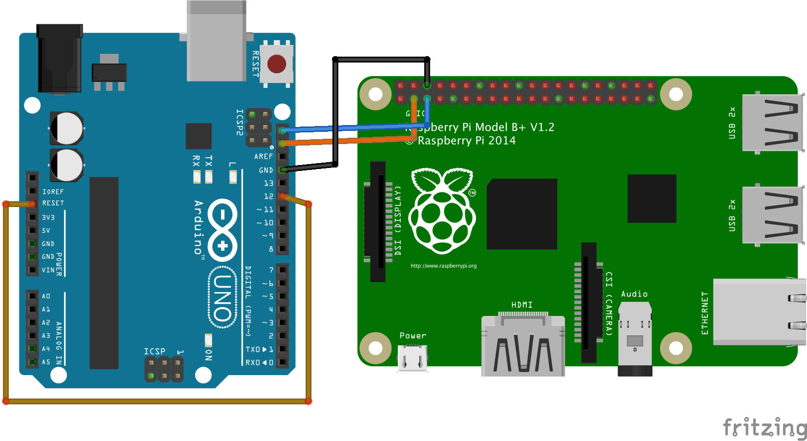

# i2c-arduino-slave
An I2C slave project built on top of the Wire.h library. Designed to easily drop into a variety of projects which can then be managed by an I2C master.

This project uses a combination of an in-memory array and EEPROM as the I2C registers. The in-memory array by itself is obviously volatile and unsustainable across device restarts. To mitigate this, it is possible to write the contents of the in-memory array to the device EEPROM. It is also possible to configure and set the device to rely entirely on EEPROM for I2C registers. This is not recommended since Arduino devices have an EEPROM lifetime of about 100K writes. EEPROM therefore is not ideal as the permanent read/write registers for many applications. 

The recommended usage pattern is to setup the long term content in the *program control* registers in the in-memory array and once the prgram is validated, write it to EEPROM for long term usage and persistence. The first *reserved* register is used to change how the system interacts with the different memory options (EEPROM and in-memory array). For example, using the first *reserved* register, we can automatically load the *program control* from EEPROM into the in-memory array on device restart.  

The following section detailing the *I2C Slave Configuration Registers* provides information on the capabilities of the *reserved* registers. Please read that section for more details and look a the examples section for some ideas about how it might be used in practice.

## I2C Slave Configuration Registers

### The first 4 *reserved* registers
The first 4 registers are special use registers for enabling the setup and development of a device as an I2C slave. There is one *control register* which is used to manipulate how the devices reads/writes I2C data. The *control register* is read when the device starts and Actions are taken according to the corresponding bit mask. The *control register* is an 8 bit mask and has 3 different types of operation:
1. Control Actions which are immediate (unless the NOACTION bit is set). These actions effect the memory storage location (EEPROM vs in-memory).
	* Load EEPROM to local memory 
	* Always read registers from EEPROM
	* Force device reset
1. One time Actions which occur immediately. These correlating bits are not stored in the control register. 
	* Reset all EEPROM registers - operates on EEPROM regardless of the WRITE_TO_EEPROM bit
	* Load local memory into EEPROM
	* Force device reset
1. Restart Actions which are delayed until restart. The correlating bit is stored in the control register.
	* Load slave address
With the exception of the *Restart Action*, all other *Actions* happen immediately when processed unless the NOACTION bit is set. If the NOACTION bit is set 
* The action bits are unprocessed and 
* The mask is written to the corresponding persistent register based on the WRITE_TO_EEPROM bit

Some actions also have persistent bits. The correlating program flags are set or actions are taken and the bits are preserved. 
* Persistent Actions
	* Load slave address from register
	* Load EEPROM to local memory
	* Always read registers from EEPROM
* The persistent mask can be represented by either
	* B00001110  
	* 0x0E
* Whenever the Control Register is modified, the changes are made by reading the values of the least significant bit first.

* Read location.
	* The program will always read from in-memory store unless the READ_FROM_EEPROM bit is set. In which case, it will read from EEPROM
	* This is useful for operating from EEPROM while also making updates to the in-memory store - which can later be transferred to EEPROM

```
0x00 - EEPROM Control Register
    - Controls the reading and writing to EEPROM via I2C
    - Default 0x02
    Mask values 
    - 0x01 Write the bits to the control register but do not
      - overwrite in-memory store even if the bit is set
    - 0x04 Load EEPROM to local memory
    - 0x08 Always read registers from EEPROM
        - if this bit is not set, values are read from local memory
    - 0x10 This bit is ignored on the incoming control value
      - This bit is stored and returned based on the EEPROM read value
      - 1 when reading from EEPROM
      - 0 when reading from in-memory
    - 0x20 Reset all registers including the control register to default values
		  - this bit will always be 0 in the saved register
    - 0x40 Load local memory into EEPROM - including control register 0x00 
		  - this bit will always be 0 in the saved register
    - 0x80 Force device reset 
		  - this bit will always be 0 in the saved register
```

### Slave Alternate Address
The program allows for selecting any I2C slave address as this devices address as long as it is within the range 0x03 to 0x77. *NOTE* The slave alternate address will only be loaded if the EEPR0M_SLAVE_ALT bit is set in the control register.

```
 0x01 - Slave address
    - The slave address is set to 0x08 programmatically
    - If an alternate slave address is desired, it can be set in this register
```

### Program Control Custom Default Value
The program control default value is set to 0x00. This can be modified to be any value between 0x00 and 0xFF such that when and empty register is read, the custom default value is returned. This is the value written when the EEPROM_RESET action is taken.
```
 0x02 - Default value for program control registers
    - 0x00
```

### Program Control Offset
Currently UNIMPLMENTED. This is reserved for creating a secondary offset in EEPROM to store PROGRAM control register values as the total amount of EEPROM on some devices is greater than the amount of registers available in the I2C spec.

```
0x03 - Program control offset. 
	- This can be used to extend where the program is stored
	- This can only work if if the device has more EEPROM available. It's not magic
	- The default offset is this register+1
	- This functionality is CURRENTLY UNIMPLEMENTED
```

### Program control registers
```
0x04-0xFF Program Control
    - use as needed based on I2C communication via the device
```
## Example wiring between RPi (master) and Arduino (slave)


## Example Controls using a linux master running i2c-tools
### Restart the device with a new slave address
Note that the device is on 0x08 by default so we use that address to send the configuration changes to restart the device on 0x33
```
i2cset -y 1 0x08 0x01 0x33 #set the slave address to 0x33
i2cset -y 1 0x08 0x00 0x81 #set the control register to use the new slave address and reset the device 
i2cset -y 1 0x33 0x00 0x03 #using the new slave address. Retain the use of the slave address and load EEPROM content to the local memory registers
```
### Feed a program into the local memory and then store it in EEPROM
This is useful to configure a program in memory and then store it for long term use to run from EEPROM
```
i2ctransfer -y 1 w17@0x08 0x42 0xff- #write 17 bytes of data in descending order starting at offset 0x42
i2cset -y 1 0x08 0x00 0xC8	# Set the system to read EEPROM registers on restart, 
							# Store the local memory in EEPROM and 
							# reset the device
```

## Known challenges with I2C
* Master / Slave voltages should be the same. 
	* If they are not, it is acceptable for the master to drive the slave as long as the master runs at a lower voltage
	* If they master has a higher voltage, a logic converter is required 
* In order for devices with RTC to do I2C, they must use a software methodology called *clock pulse stretching*
    * sometimes this results in cycle delays and the appearance of lost bits
    * this seems to be able to be mitigated in code by adding a slight delay at certain points
        `delayMicroseconds(20);` 


## Testing

### I2C Slave Testing
* Tests must be run from a Master with `i2c-tools` installed.
* The Arduino must have the program loaded an the reset pin wired to pin 12
* Copy the `test/` directory to the I2C master
* From the test directory, run `make i2c-test` 
* Also, it's possible to create an output log with `make i2c-test >> i2c-test.log 2>&1`
* Sometimes there are errors with i2c-tools in which an erroneous value `XX` is received. This causes errors like the following in the output. Note: the Unexpected value is blank. This is likely caused by how the arduino does *clock pulse streching* for I2C.
    ```
	Error: Read failed
	FAIL: Expected register 0x31 value to be 0x00
	FAIL: Unexpected value:
    ```

### I2CSlaveMode Arduino Library testing
* To be developed ...
